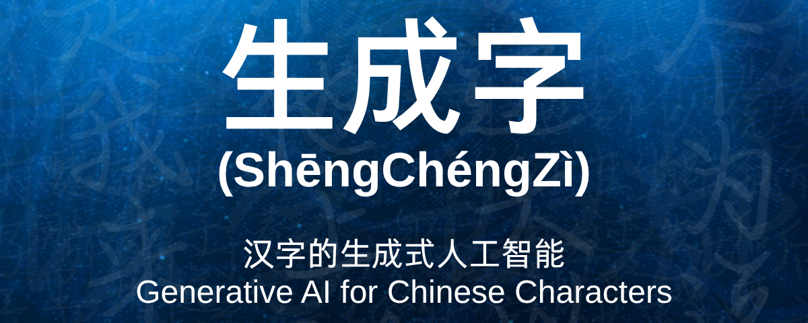

生成字 (ShēngChéngZì) is a Generative AI toolkit for various tasks involving Chinese characters, including:

- **Random-to-Character (R2C)**  
For a given random latent vector, generate an image of a Chinese character.

- **Text-to-Character (T2C)**  
For a given text prompt, generate an image of a Chinese character.

- **Character-to-Character (C2C)**  
For a given Chinese character, generate an image of its simplified or traditional variant.

## Getting Started

1. Clone the repository

    ```bash
    git clone https://github.com/awisniewski21/ShengChengZi.git
    ```

2. Install the dependencies

    ```bash
    pip install -r requirements.txt
    ```

3. Generate the Chinese character datasets

    ```bash
    python gen_datasets.py
    ```

    This will generate both paired and unpaired datasets of 64x64 images using the fonts in `data/fonts` and the Unihan data from `data/unihan`

4. Train the models using the Python training scripts (see the [Training](#Training) section)
5. Evaluate the trained models on their test datasets (see the [Testing](#Testing) section)
6. Perform inference with the pretrained models on any input (see the [Inference](#Inference) section)

## Training

The repository root contains Python scripts for training different models on various tasks.

### Available Models

- **CycleGAN** - Conditional GAN
  - Character-to-Character (Unpaired, Bidirectional)

    ```bash
    python train_c2c_cyclegan.py
    ```

- **Glyffuser** - Standard and Conditional Diffusion Models
  - Random-to-Character

    ```bash
    python train_r2c_glyffuser.py
    ```

  - Text-to-Character

    ```bash
    python train_t2c_glyffuser.py
    ```

- **Palette** - Conditional Diffusion Model
  - Character-to-Character (Paired, One-way)

    ```bash
    python train_c2c_palette.py
    ```

- **Pix2Pix** - Conditional GAN
  - Character-to-Character (Paired, One-way)

    ```bash
    python train_c2c_pix2pix.py
    ```

- **ShengChengZi** - Conditional Diffusion Model
  - Character-to-Character (Paired, Bidirectional)

    ```bash
    python train_c2cbi_scz.py
    ```

All models output TensorBoard logs, checkpoints, and validation images to their respective output directories.

### Configuration

Config options for each model are defined in the `configs` directory. All training scripts accept CLI arguments to override the default config values. Run them with `--help` to see a full list of options.

## Testing

To evaluate a trained model on its test dataset, run the corresponding test Python scripts and pass the pretrained model checkpoint path as input.

```bash
python test_*.py -p <PATH TO CHECKPOINT>
```

## Inference

To perform inference with a pretrained model on any input, run the corresponding inference Python scripts and pass both the input data and the pretrained model checkpoint path as input.

```bash
python inference_*.py <INPUT DATA> -p <PATH TO CHECKPOINT>
```

## Acknowledgements

The `cyclegan` model is based upon the [paper](https://arxiv.org/abs/1703.10593) and [repo](https://github.com/junyanz/pytorch-CycleGAN-and-pix2pix) by Jun-Yan Zhu et al.

The `glyffuser` model is based upon the [article](https://yue-here.com/posts/glyffuser/) and [repo](https://github.com/yue-here/glyffuser/tree/main) by Yue Wu.

The `palette` model is based upon the [paper](https://arxiv.org/pdf/2111.05826) by Chitwan Saharia et al. and the [repo](https://github.com/Janspiry/Palette-Image-to-Image-Diffusion-Models) by Liangwei Jiang et al.

The `pix2pix` model is based upon the [paper](https://arxiv.org/pdf/1611.07004) by Phillip Isola et al. and the [repo](https://github.com/junyanz/pytorch-CycleGAN-and-pix2pix) by Jun-Yan Zhu et al.
